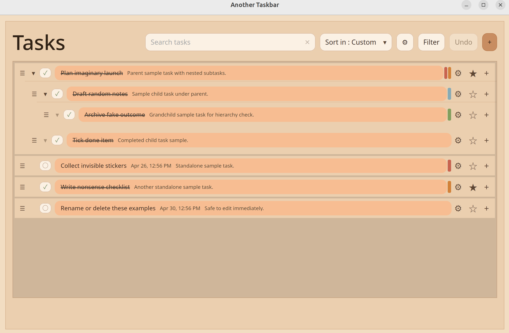
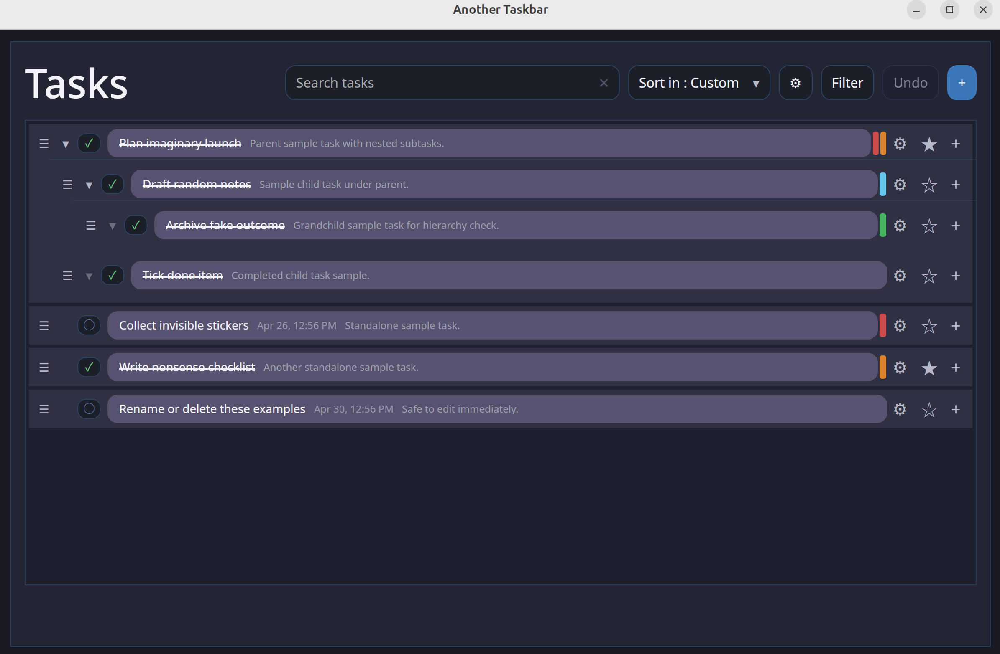

# Another Taskbar

`another_taskbar` is a Rust task manager with a shared core and two interfaces:

- CLI for fast entry, scripting, and batch operations
- Tauri desktop GUI for visual planning and editing

Tasks are stored in JSON as a nested tree, with recurrence, filters, undo, and shared settings.

## Latest Summary

- Unlimited nested subtasks
- Task states: `Todo`, `InProgress`, `Blocked`, `Completed`, `Archived`
- Optional urgency/importance and pinned tasks
- Tags with common-tag suggestions
- Search + multi-field filters (state/urgency/importance/pinned/tags)
- Recurring tasks with automatic refresh
- Drag-and-drop reorder/move in GUI (custom sort)
- Mobile-friendly swipe quick actions in GUI
- Undo of last undoable change
- Theme support (`themes/*.toml` + imported custom themes)
- UI scale, language (`en`, `zh-CN`), and close-action preferences
- Due-time notifications (desktop tray + notification flow)

## Screens




## Build

```bash
cargo build
cargo build --release
```

## Run

```bash
# CLI
another_taskbar --cli

# GUI
another_taskbar
another_taskbar --gui
```

## CLI Commands

Commands can be chained in one line.

```text
add [options]
update <id> [options]
delete <id>
delete all [--yes]
list
show <id>
stats
save [--file FILEPATH]
load [--file FILEPATH]
setting NAME VALUE
filter ...
search "STRING"
search --clear
undo
wipe-data [--yes]
help [COMMAND]
exit | quit
```

### CLI Examples

```bash
add --name "Ship release" --state inprogress --urgency high --importance high --tags release,docs --pinned
add --parent 3 --name "Write README"
update 3 --state completed --tags release,done
filter --importance high
search "release"
save --file work.json
load --file work.json list stats
```

## Data Files

- Default task file: `taskbar.json`
- GUI settings: persisted in app config (`settings.toml`)
- Themes: app theme dir + imported TOML files

## Project Layout

```text
src/
  app/          Shared runtime + CLI/GUI entry points
  gui/          Tauri commands and GUI settings
  input_parse/  CLI parser and prompts
  tasks/        Task model, recurrence, filter, sorting, undo
  files.rs      Persistence and statistics helpers
  main.rs
ui/             Tauri frontend (HTML/CSS/JS)
themes/         Bundled theme files
tests/          Integration tests
```

## Check

```bash
cargo check
cargo test
```
